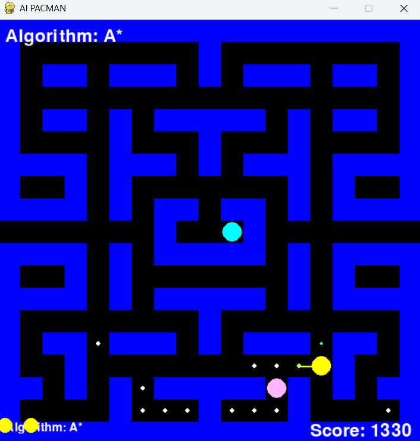

# AI PACMAN 🟡

An AI-powered PACMAN game that combines classic arcade fun with intelligent pathfinding. Guide PACMAN to collect all food pellets while avoiding ghosts, powered by cutting-edge search algorithms.

## Features 🎮

- **Classic PACMAN Gameplay:** Navigate through a maze to collect food pellets and power pellets.
- **Intelligent Ghosts:** Each ghost has a unique behavior—chase, ambush, or patrol.
- **AI Pathfinding:** PACMAN uses BFS, DFS, or A* to find the best route to food while avoiding danger.
- **Dynamic Visualization:** Watch the exploration paths of different algorithms.
- **Customizable Algorithms:** Switch between pathfinding algorithms during gameplay.
- **Real-Time Scoring and Lives Tracking.**

## Installation🛠

1. Clone this repository:

`git clone https://github.com/your_username/ai-pacman.git`

`cd ai-pacman`

2. Install the required dependencies:

`pip install pygame numpy`

## Usage

Run the game with:

`python main.py`

## Controls

- Arrow Keys: Navigate the menu.
- Space: Restart the game after game over.
- ESC: Quit the game.
- A / B / D: Switch between A*, BFS, and DFS algorithms.

## Technologies Used 🔍
-  Python 3.12 🐍
- Pygame 🎮 for game rendering
- Numpy 🧮 for efficient maze representation
- Search Algorithms: BFS, DFS, A*.

## Contributing
Contributions are welcome! Fork the repository, create a new branch, and submit a pull request.